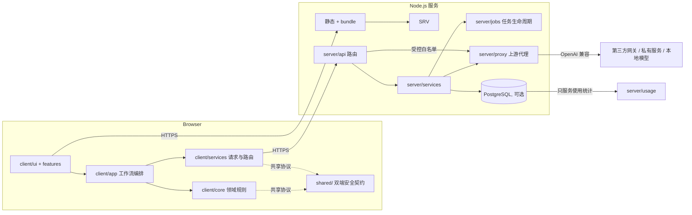

# 02 总体架构与模块边界

> 本文是架构的规范层；模块边界的逐文件细节以 `docs/architecture.md` 为准。

## 1. 架构总览

## 2. 分层职责

### 2.1 浏览器

| 层 | 目录 | 职责 | 禁止事项 |
| --- | --- | --- | --- |
| 领域核心 | `client/core/` | 独立可测的领域规则：消息、模型、附件、上下文预算、图片引用、执行资源、任务状态 | 直接操作 DOM、发起网络、依赖服务端/数据库 |
| 服务 | `client/services/` | API 调用、payload 组装、路由与意图服务 | 依赖 UI 或应用会话状态 |
| UI | `client/ui/` | DOM 渲染与交互助手 | 掺入服务端实现细节 |
| 功能模块 | `client/features/` | 面向用户的特性实现 | 违反下方依赖方向 |
| 编排 | `client/app/` | 应用状态与工作流编排，兼容门面 | 新增重复业务实现 |
| 配置 | `client/config/` | 存储 key、feature flag | 存放业务逻辑 |
| Markdown | `client/app/markdown/` | 解析、消毒、增强、流式渲染 | 浏览器版与 Node 测试版漂移（两侧契约须一致） |

### 2.2 服务端

| 层 | 目录 | 职责 | 禁止事项 |
| --- | --- | --- | --- |
| 路由 | `server/api/` | HTTP 分发与控制器 | 直接写代理/存储实现 |
| 服务 | `server/services/` | 用例编排与外部集成 | 绕过 logging/validator |
| 任务 | `server/jobs/` | chat/image/image-batch 任务生命周期与 SSE | 自行写原始上游 payload 到日志 |
| HTTP | `server/http/` | body、response、静态文件与缓存 | 混入业务用例 |
| 代理 | `server/proxy/` | 上游转发与流式解析 | 绕过方法与路径白名单 |
| 安全 | `server/security/` | principal、任务归属、URL 策略 | 让静态资源绕过安全头 |
| 数据 | `server/db/`、`server/usage/` | PostgreSQL 与统计 SQL | 影响聊天/图片核心链路 |
| 校验 | `server/validators/` | 请求、幂等、能力契约 | 在路由里复制校验 |
| 支撑 | `server/config/`、`server/errors/`、`server/logging/` | 配置、统一错误、安全日志 | 新增只做转发的错误模块 |

## 3. 禁止的依赖方向

- `shared → client` 或 `shared → server`
- `client → server`、数据库、SQL、Node-only runtime
- `server → client/app`、`client/ui` 或浏览器全局
- `client/core → client/services`、DOM、网络
- `client/services → client/ui` 或应用 session state
- `client/ui → server payload/proxy implementation`
- `vendor → application code`
- 新业务逻辑进入根 `app.js`
- 服务端数据或凭据进入静态公开目录

服务端与浏览器层都可以依赖 `shared/`；高层编排可以依赖低层契约，反向禁止。

## 4. 关键机制

### 4.1 静态服务、bundle 与缓存

- `index.html` 内嵌 `chatuiAssetManifest`；服务端读取清单并按顺序拼接 JS/CSS bundle。
- 入口页每次渲染时把 bundle URL 重写为 `?v=<内容 ETag>`，并注入 `__CHATUI_ENTRY_IDENTITY`（版本、Git SHA、runtime source fingerprint）。
- 缓存语义：入口 HTML 与直连 `.js/.css/.json` 为 `no-store`；`?v=` 与当前指纹一致的 bundle 为 `public, max-age=31536000, immutable`；裸 URL 或指纹不匹配仍为 `no-store`。字体/图片等非可执行资产使用短缓存。

### 4.2 路由与执行流水线

`理解节点(intent_understanding.v1) → 路由节点(route_intent.v3) → 本地校验/定向修复 → dispatch_contract.v1 → 执行`。协议无效、超时、限流或预算用尽时失败关闭，不本地猜测。详见 `docs/intent-recognition-cot-design.md`。

### 4.3 任务生命周期

chat/image/image-batch 由服务端 job store 管理，SSE 推送事件；浏览器可刷新恢复、停止、重新生成。principal cookie 隔离任务归属。

### 4.4 Markdown 与 vendor

DOMPurify、markdown-it、KaTeX、highlight.js、Mermaid 通过 dependency loader 按需加载；Mermaid 等重资产不进首屏。渲染必须过消毒与链接策略。

### 4.5 可观测性

access/error/server/request-trace 四类 NDJSON 日志，独立有界异步队列；请求带 `trace_id`；系统提示词只记长度/哈希，敏感值不落盘。

## 5. 部署形态

- Docker 直接复制运行所需根文件与目录；不从 `dist/` 启动，也不在构建期生成另一套源码。
- 默认 `0.0.0.0:8765`；`server/app.js` 是服务端 composition root，关闭时先结束 SSE、刷新日志队列，再关闭连接池与 sweeper。