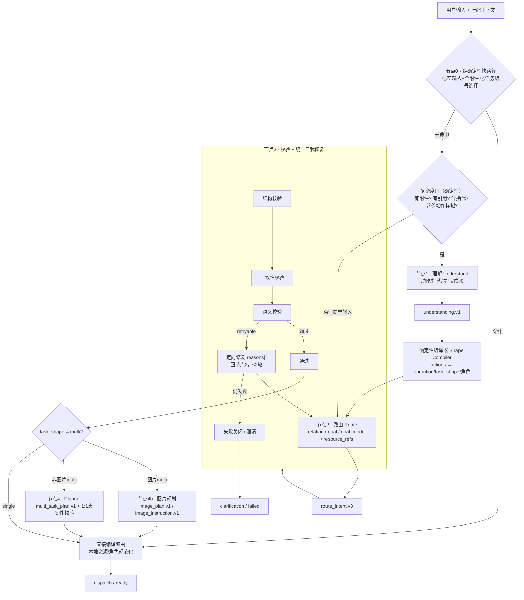

# 意图识别「思维链 + 自我修复」改造设计（v2）

> 本文是意图识别后续改造的唯一参考设计文档。所有相关改造必须先对照本文的场景覆盖矩阵与保留边界清单，避免回归现有能力。当前运行时已按“理解 → 路由”节点提示词执行；本文描述目标形态并记录剩余压缩与修复工作。

## 0. 当前进度（2026-08-28 施工状态）

已完成并验证：

- Phase 0：`shared/intent-understanding.js`（`understanding.v1` 契约、kind 闭集、角色表、Shape Compiler、`planCoversExpected`）；服务端 `requestPurpose=intent_understanding` 白名单与审计已支持。
- Phase 1：理解节点 + Shape Compiler 已接入 `route-intent-workflow`，`task_shape` 由 Shape Compiler 本地覆盖；理解 schema 已去除网关不支持的数值 `minimum` 约束，避免结构化输出被 400 拒绝。
- Phase 2：复杂路径路由使用独立的 `ROUTE_NODE_SYSTEM_PROMPT`，并把 `understanding` 作为已解析证据注入路由 payload；relation 规则保持节点内聚。
- Phase 3：理解节点输出无效、路由输出无效、plan 不忠实均各做一次 `reasons[]` 定向修复重试，仍失败则失败关闭；路由节点新增确定性语义校验，覆盖 `relation=new` 与非 current 资源矛盾、quoted 证据必须 followup（new/continuation 都要修）、`amend` 无前序 base、单 action 的 operation 与 kind 映射不一致，并对主模型与 fallback 模型统一执行同一套校验+修复路径。
- Phase 4：`multiTaskPlan` 持久化；规划 1:1 忠实性校验。
- Phase 5 提示词部分：`UNDERSTAND_SYSTEM_PROMPT` 现在完整声明 `intent_understanding.v1` 输出、kind 闭集、按独立结果拆分 action 的规则与完整示例（≤2600 字符）；`ROUTE_NODE_SYSTEM_PROMPT` 完整声明 `route_intent.v3` 输出与正反示例（≤6400 字符）；简单路径与复杂路径都不再向模型发送旧单次巨无霸提示词。
- Phase 5b：路由节点提示词按复杂/简单两条路径组织。复杂路径（理解证据存在）的 `ROUTE_NODE_SYSTEM_PROMPT_COMPACT` 与完整版 `ROUTE_NODE_SYSTEM_PROMPT` 共享同一份完整规则集（≤6400 字符，含 operation 边界、资源角色、relation 1-4、交付事实与正反示例；理解节点只补充动作/指代/依赖证据，不裁决 operation 边界、资源角色、relation 语义、goal_mode 与澄清策略，实测精简版会丢失这些规则并导致误路由）；简单路径（复杂度门判定无附件/引用/指代/多动作）走独立精简版 `ROUTE_NODE_SYSTEM_PROMPT_SIMPLE`（≤4000 字符，质量优先，只移除复杂度门证明不可达的 quoted/指代/多资源段落）；理解节点失败或输出空动作时同样回退完整规则集。
- 多图兜底：即使理解模型把多图请求合并为一条 action，Shape Compiler 仍按原文显式**输出结果数量**提升到 image_plan，并有端到端回归测试。`explicitImageResultCount` 只识别输出结果单位（生成/改成 N 张、视图枚举、分别枚举），不会把“参考两张图生成一张新图”的输入图或“两只猫”的画面主体误判成多个结果；数量期望与修复门禁对简单路径和 CoT 路径一致生效；显式输出结果数超过 `image_plan` 结构上限（50）时，在调用规划器前由本地护栏确定性失败关闭（按产品上限提示分批），不再把模型无法满足的数量交给规划器。
- Phase 5c 执行可观测性：修复轮不再与主识别共用 `intent_recognition`。`route_repair`、`route_fallback`、`multi_task_planning`、`image_planning` 成为独立 requestPurpose，服务端校验白名单与 access audit 同步；修复轮把 `reasons[].code` 以 `repair_reasons` 写入 `access.ndjson`（仅稳定 code，无正文）。
- 依赖一致性：`reconcileUnderstandingDependency` 在 route payload 物化前把 quoted/非 current 资源等本地事实优先于 `understanding.dependency` 落定，避免 CoT 路径出现“照抄 dependency”与“quoted→followup 校验”互相矛盾导致的修复轮空转/fallback。
- 自由文本澄清答案闭环（根因 + 护栏）：图片指令物化（image_instruction）只产出无选项文本槽（type=text、choices=[]）的澄清（如“继续画一只猫？什么品种/毛色/姿态”）。此前用户用自由文本回答（“你随机/随便/橘猫”）永远不被当作答案，pending 澄清永不关闭、`clarification_context.answer_complete` 恒为 false，物化器会无限次重复追问，且澄清轮次计数器不推进。现在：`parseClarificationAnswer` 对仅含文本槽的澄清把用户自由文本记为 `clarification_answer.v1.free_text` 并视为完成；`applyClarificationAnswer` 用非空 free_text 满足文本槽；`clarification_context` 输出 `answer_complete=true`、`free_text`、剩余 `unresolved_resources`（不含已答槽）；submit 边界把自由文本答案作为本轮 current_input 重新路由（结构化选择答案仍路由 base_task）。物化器提示词同步新增：用户显式委托（你随机/随便/你决定/看着办/都行/you choose/up to you）或澄清已回答（answer_complete=true）时，必须按 resolved_task 输出 ready 的具体指令，不得再追问已委托的细节；“不得虚构事实”仅约束指代性事实，不约束用户已委托的未指定细节。回归测试：澄清答案协议（text-only 槽解析/应用/上下文）、submit 重路由（自由文本作为 current_input 并消费 pending）、物化器提示词契约。
- 消息≠文件（根因 + 护栏）：提示词新增“消息（mN）只能绑 context；对引用消息文字的任务→plain_chat+mN=context；file_qa/multimodal_qa 必须绑 f=attachment 文件，禁止把 mN 当文件绑定”（理解节点与三份路由提示词同步，均有长度断言）。兜底：`reconcileUnderstandingKinds` 仅在 action 绑定 mN 消息、且候选目录完全缺失所需文件/图片类型这一确定性矛盾下降级 `file_read/image_read/ocr → plain_text`（无引用的资源任务不降级，走正常缺资源澄清）；`routeIntentSemanticIssuesForIntent` 对“消息绑成文件角色 / file_qa 无文件引用”给出字段级 reasons 进入统一修复轮（按本轮 `rejectedOutput` 判定，修复成功后不再被首次输出否决）。 同向，`reconcileUnderstandingKinds` 也会把“`plain_text` 却绑定 fN/iN 资源”提升为 `file_read`/`image_read`（使“总结文件→画猫”这类多任务期望为 `file_qa`+`text_to_image`，1:1 校验可对齐）；`MULTI_TASK_PLAN_SYSTEM_PROMPT` 明确禁止把“画/生成/编辑图片”因“或者/如果不能”等表述降级为 `plain_chat`。

待办（后续轮次）：

- 细粒度修复已覆盖确定性矛盾；goal 自洽、遗漏动作等更高层语义修复仍待后续。
- 复杂路径（COMPACT）与完整版共享完整规则集（≤6400 字符），不再单独压缩；简单路径用独立精简版（≤4000，质量优先，不删任何可达规则；仅移除复杂度门证明不可达的 quoted/指代/多资源段落）。后续仍可在真实模型 eval 证明语义无损后继续收窄。
- 理解节点偶发失败或输出合法但 `actions=[]` 时，均视为不可用证据并回退完整版路由节点；继续用真实模型 eval 收敛。
- fallback 模型当前仍与主模型共用相同的 ≤2 轮语义修复预算（选项 D 的差异化预算待评估）。

## 1. 设计原则

1. **语义归模型，形状与绑定归本地**：模型负责“理解语义”与“写执行指令”；`task_shape`、`operation` 映射、资源角色、候选绑定由本地确定性计算。
2. **节点输出结构化、闭集、可校验**：节点之间不传递自由文本决策，只传版本化协议对象与 evidence。
3. **单一修复协议**：所有节点复用同一套错误分类、定向重试与失败关闭；不与传输层兼容重试混在一起。
4. **成本有界**：复杂输入最多 2 次模型调用（理解→路由），简单输入 1 次；修复 `≤2` 轮；统一受 `INTENT_DEADLINE_MS` 与 `attemptLedger` 约束。
5. **确定性护栏不做语义裁决**：节点0只处理无需语义的路由；资源/角色/绑定/任务形状永不在模型输出上“猜”。
6. **全场景覆盖**：改造必须覆盖本文第 9 节列出的全部当前场景；未列入的新能力要先补矩阵再实现。

## 2. 目标流水线



## 3. 节点职责与协议

| 节点 | 类型 | 职责 | 输出协议 |
| --- | --- | --- | --- |
| 0 快路径 | 纯本地 | 空输入全附件、任务编号选择 | 直接路由（无模型调用） |
| 复杂度门 | 纯本地 | 决定是否运行理解节点 | bool |
| 1 理解 Understand | 模型 | 抽取动作、消解指代、`dependency` 依赖证据 | `understanding.v1`（新增） |
| Shape Compiler | 纯本地 | 由 `actions` 推导 `operation / task_shape / 必需资源角色` | shape 证据 |
| 2 路由 Route | 模型 | `relation / goal / goal_mode / resource_refs` 终稿 | `route_intent.v3`（复用） |
| 3 校验·修复 | 本地 + 极短模型 | 结构/一致性/语义校验 + 定向修复 | 通过 / 修复 / 失败 |
| 4 Planner | 模型 | 非图片多任务拆解 | `multi_task_plan.v1`（复用） |
| 4b 图片规划/指令物化 | 已有 | 图片多任务拆分、图片指令物化 | `image_plan.v1` / `image_instruction.v1` |

## 4. 确定性编译器 Shape Compiler（完整规则）

### 4.1 kind 闭集枚举与 operation 映射

`understanding.actions[].kind` 必须是下列闭集之一；`kind → operation` 本地查表完成：

| kind | operation | 必需资源角色 |
| --- | --- | --- |
| `plain_text` | `plain_chat` | 可选 `message:context` |
| `web_search` | `web_search` | 可选 `message:context` |
| `file_read` | `file_qa` | `file:attachment`（≥1），可选 `message:context` |
| `image_read` | `image_qa` | `image:source`（≥1），可选 `message:context` |
| `ocr` | `ocr` | `image:source`（≥1），可选 `message:context` |
| `image_compare` | `image_compare` | `image:compare_a`（恰好1） + `image:compare_b`（恰好1） |
| `multimodal_qa` | `multimodal_qa` | `image:source`（≥1） + `file:attachment`（≥1）；仅当明确要求图文联合分析时选此 kind，图文并存但无联合要求不自动判定 |
| `image_generate` | `text_to_image` | 无图片/文件绑定 |
| `image_reference` | `image_reference_gen` | `image:reference`/`style_reference`（≥1） |
| `image_edit` | `edit_image` | `image:target`（恰好1）；可选 `reference` / `style_reference` / `mask`（0..1） |

### 4.2 task_shape 分流规则

```
actions 为空（且无可用全附件）          → clarification
actions 为空（当前附件全部可用）        → 节点0 确定性路由：仅图 image_qa / 仅文件 file_qa / 图文 multimodal_qa
actions = 1                            → single
actions > 1 且全部属于图片生成/编辑/参考
                                       → 图片multi → 节点4b image_plan.v1
actions > 1 且包含非图片 operation       → 非图片multi → 节点4 multi_task_plan.v1
```

`image_compare` 是 1 个 action、2 个角色，属于 single（一次对比 dispatch），不是 multi。

同一问题跨多张图/多个文件的合并由节点1 完成（“第二张和最后一张是什么颜色”→ 一条 action）；Shape Compiler **不再**把多条读图/看文件动作本地折叠为 single，多条同 kind 读动作按多条独立问题进入 multi_task_plan，避免静默丢失问题。

## 5. 路由节点规则

节点2 只产出 `route_intent.v3` 的语义终稿，输入为 `understanding` + shape 证据 + 候选目录。

### 5.1 relation 聚焦切分

- 节点1 只给“依赖证据”：是否引用了 quoted/history/previous_execution、是否明显否定/纠正/继续，落在闭集 `dependency ∈ { new, followup, continuation }`；
- 节点2 以 `dependency` 为候选并按 relation 1→4 规则最终判定 `new / followup / continuation`，不得盲信候选；
- relation 使用独立聚焦提示词 + 独立校验，不与 operation/goal 规则混排；
- 确定性校验补两条强矛盾：quoted 证据存在时 relation 必须为 followup（不得 new/continuation）；单 action 时 operation 必须等于 `operationForKind(actions[0].kind)`。

### 5.2 goal_mode 与图片任务连续性

- `goal_mode ∈ { replace, amend }`；
- `amend` 仅允许 `text_to_image / edit_image` 且必须存在有效前序 task_state（现有 schema 护栏保留）；
- `plain_chat / web_search / 文件看图类 / image_reference_gen` 一律 `replace`；
- 本地 `task_continuity.v1` 规则不变。

### 5.3 goal 物化

goal 是资源消解/历史依赖/图片任务的下游执行指令：只消解指代、合并明确约束，不写候选键/资源ID，不增加未提主体/场景/风格，不写分析、理由、operation、澄清问题。

### 5.3.1 provider prompt 规则（保留）

- chat 系操作（`plain_chat` / `web_search` / `file_qa` 等）保留原文输入；任务选择回合用计划 task goal 作为 provider prompt；
- `text_to_image` 使用 `task_continuity` 渲染后的完整任务状态；`edit_image` 只发送当前编辑指令（目标图承载视觉基线）；`image_reference_gen` 建立 replacement 状态；
- `image_instruction` 自足快路径（完整 goal 不再二次物化）保留；

## 6. 统一错误分类与自我修复协议

| 错误 | 类别 | 处理 |
| --- | --- | --- |
| `schema_invalid` | 结构 | 可一次重试，否则失败关闭 |
| `binding_invalid` | 本地可修 | 本地补绑，不调模型 |
| `role_mismatch` | 本地可修 | 按 operation 规范化角色，不调模型 |
| `shape_mismatch` | 本地可修 | 以 Shape Compiler 为准，不调模型 |
| `goal_not_self_contained` | 可重试 | 回节点2 |
| `missing_actions` | 可重试 | 回节点2 |
| `relation_inconsistent` | 可重试 | 回节点2 |
| `plan_not_faithful` | 可重试 | 回节点4 |
| 其余 | fatal | 失败关闭 |

修复规则：`retryable` 错误把 `{ rejected_output, reasons[] }` 作为 evidence 追加，要求“只修 `reasons[]` 指出的字段，其余保持不变”；修复轮次上限 `≤2`；仍失败统一失败关闭/澄清。节点数、调用数、修复次数全部复用 `INTENT_DEADLINE_MS` 与 `attemptLedger`。

## 7. 复杂度门与成本

确定性规则决定是否运行节点1：

- 有附件且有文本；
- 有 quoted；
- 含指代（这个/那个/它/第N张/上一张/最近话题…）；
- 含多动作连接词（先/再/然后/之后/接着/同时/分别/既要…又要…）。

命中任一条 → 运行节点1；否则跳过节点1，直接节点2。组合请求必然走节点1，从而稳定进入规划；简单请求不增加调用。

## 8. 保留边界清单（本次改造不改变）

- 候选目录构建与图片记忆检索（`route-candidates` / `image-route-context` / `route-memory-retrieval`）仍是识别前的前置阶段；
- quoted `bound_only` 与来源优先级（quoted > history，P1–P5，mN）由本地确定性逻辑保留；
- 手动模式约束（`auto_mode=false` / `current_mode=chat|image|edit_image` 的允许 operation 表）保留；
- 本地非模型编译路径（`compileEmptyCurrentAttachmentSetRoute`、`createExplicitTextToImageRoute`、`compileLocalRoute`、任务编号确定性选择器）保留；
- 传输层兼容重试（结构化输出 / reasoning / tool_choice fallback）与节点3 的语义修复分离；
- 下游 `dispatch_contract.v1`、图片指令物化、图片指令修复、Job/usage/provider capability、澄清持久化、regenerate/edit-resend 工作流保持不变；
- `image_instruction` 自足快路径（完整 goal 不再二次物化）保留；
- 主模型失败后的 fallback 路由模型重试（primary → fallback）保留；
- 本地 relation 覆盖模式（显式话语 follow-up 短句）与 vague-image 续作本地规则保留为节点3 一致性校验/兜底；
- 澄清轮次上限与 pending 持久化协议保留；
- `web_search` 工具授权、provider capability、usage 计费仍在 dispatch/执行层校验，不进入识别层重排。

## 9. 全场景覆盖矩阵

### 9.1 输入形态

| 场景 | v2 处理 |
| --- | --- |
| 普通文本指令 | 复杂度门→节点2（简单输入 1 次调用） |
| 空输入 + 当前附件（仅图/仅文件/图文） | 节点0 确定性路由 |
| 带附件 + 文本 | 复杂度门→节点1→Shape Compiler |
| quoted 引用消息/附件 | 节点1 理解 resolved_refs + 本地 bound_only |
| 多动作组合/顺序链 | 节点1 actions→multi→节点4 |
| 模糊指代 | 节点1 消解 + 本地候选绑定 |
| 空输入且无可用附件 | 澄清 |
| 超长/受保护上下文 | 现有 `ROUTE_CONTEXT_REQUIRED_CONTENT_TOO_LARGE` 失败关闭 |
| 任务编号选择（含中文数字、越界） | 节点0 确定性选择器 |

### 9.2 operation / 资源角色

见第 4.1 节全表（10 个 operation、全部角色与数量约束）。

### 9.3 task_shape

| 场景 | v2 处理 |
| --- | --- |
| 单动作 | single |
| 同一问题跨多资源（节点1 合并为一条 action） | single 聚合 |
| 多图分别生成/编辑/参考 | 图片multi → image_plan |
| 跨 operation / 非图片多独立结果 | 非图片multi → multi_task_plan |
| 图片对比（1 action 2 角色） | single |

### 9.4 relation / goal_mode / 图片连续性

- new / followup / continuation：节点1 证据 + 节点2 聚焦判定；
- amend 前序状态护栏、task_continuity.v1、image_instruction 快路径保留。

### 9.5 模式与修复

- auto_mode=true：模型路径；auto_mode=false：本地编译/手动模式约束保留；
- 结构/一致性/语义三类修复与传输层 fallback 分离，全部有界。

### 9.6 易遗漏的现有规则与兜底

| 规则 | v2 处理 |
| --- | --- |
| 图文并存但不要求联合分析 → 不自动 `multimodal_qa` | 理解节点 kind 判定规则保留 |
| 主模型失败 → fallback 模型重试 | 节点1/节点2 支持 fallback，与统一修复不冲突 |
| 本地 relation 覆盖模式（显式 follow-up 短句） | 节点3 一致性校验保留 |
| vague-image 续作本地规则 | 保留 |
| provider prompt 规则（chat 原文 / 图片任务连续性） | 见 5.3.1 |
| image memory cards 显式旧图指代 | 上下文构建前置保留 |
| 澄清轮次上限 | 下游保留 |
| `web_search` tools / provider capability / usage | dispatch 层保留 |

## 10. 提示词拆解映射

| 现有段落 | 去向 |
| --- | --- |
| 证据优先 / 【优先级】 / 【可信输入】 / 【引用与附件】 / 【历史建议边界】 | 节点1 理解 |
| 【判断顺序】 / 【operation】 / 【task_shape】 / 【resource_refs】 / 【goal】 / 【goal_mode】 / relation 1-4 / 【图片交付事实】 | 节点2 路由（relation 用聚焦子提示） |
| 【任务选择优先】 / 【歧义与空输入】 | 节点0 确定性规则 + 节点2 兜底（去掉“选第一个”） |
| `MULTI_TASK_PLAN_SYSTEM_PROMPT` | 节点4 规划 |

每个节点提示词目标 `≤1500–2500` 字符，并放一个完整输出示例。例外：简单路径提示词以识别质量为硬约束，保留全部可达规则（≤4000 字符）；理解节点按 `≤2600` 执行；复杂路径（COMPACT）与完整版共享完整规则集（≤6400 字符）——理解节点只补充证据，不裁决 operation 边界、资源角色、relation 语义、goal_mode 与澄清策略，实测精简版会丢失这些规则并导致误路由。

## 11. 回归与评估

Golden fixture（固定真实模型回归）：

1. 附件 + “一句话总结这个文件 之后再画一只狗 画完之后再讲一个笑话” → `actions=3`、`task_shape=multi`、plan 3 个 task；
2. 选“2” → `text_to_image`（0 次意图模型调用）；
3. 选“1” → `file_qa`，文件绑定 `attachment`；
4. 规划角色恒为 `attachment`（无论规划器输出 target/context）；
5. “看这两张图” → `image_qa` single；
6. 纯“画一只狗” → 1 次模型调用、`text_to_image`；
7. “比较这两张图” → `image_compare` single（compare_a+compare_b）；
8. 手动模式/空输入/超长输入回归保留现有行为。

指标：每字段准确率、valid-route 率、修复成功率、平均模型调用数、延迟。

## 12. 落地阶段

1. Phase 0：新增 `shared/intent-understanding.js`（`understanding.v1` 契约 + kind 闭集 + Shape Compiler 纯函数）；提示词改分段函数，先逐字等价拼回旧提示词；全量测试 + 真实模型 eval 基线。
2. Phase 1：接理解节点 + Shape Compiler，路由暂用旧提示词（`task_shape` 先本地覆盖）。
3. Phase 2：路由提示词瘦身 + relation 聚焦；观察 task_shape/role 方差。
4. Phase 3：统一校验/修复协议（错误分类 + reasons 重试 + 调用预算接入）。
5. Phase 4：规划 1:1 忠实性校验；`multiTaskPlan` 持久化。
6. Phase 5：删除旧巨无霸拼装；节点级提示词、示例、长度上限测试；同步架构文档/验收文档/CI。

## 13. 开放取舍

- 多调用（理解→路由）与单调用结构化 CoT（一次输出 `{understanding, route}`）可在 Phase 2 末尾用真实数据评估后二选一或做分级策略；
- 理解节点自身仍可能出错，但错误面比“六字段一次输出”小，且有 Shape Compiler + 校验器兜底。